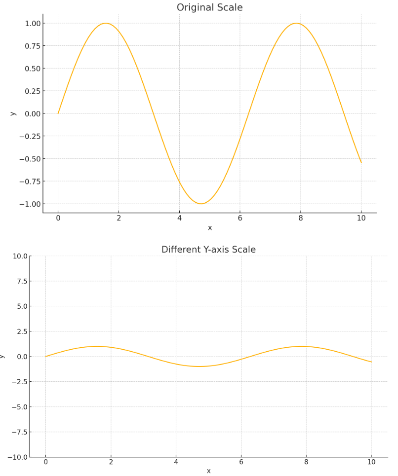

# 1.정보의 시각화
- 통계는 복잡한 것을 간단하게 만듦. 
- 통계를 이용해 데이터를 시각화해 다른 사람들에게 의미를 전달할 수 있음. 

## 통계
### 통계의 의미
**통계** : 날 것 그대로의 사실과 숫자를 뭔가 의미 있는 방식으로 정리해 주는 수 
**데이터 수집** (이미 존재하는 자료, 실험을 수행, 표본 조사를 통해 데이터를 수집함.) 
**->** 
**분석** : 사건의 발생 가능성에 대한 확률을 계산
**->** 
**결론의 도출** : 데이터에 대한 분석을 수행하고 나면 어떤 결정이나 예측을 내릴 수 있게 됨.

### 통계를 학습해야 하는 이유
1. 객관적인 결정을 내릴 수 있음
2. 뛰어난 직관처럼 보이는 정확한 예측을 할 수 있게 됨
3. 원하는 메시지를 효과적인 방식으로 전달할 수 있음
4. (타인이) 부정확한 사실이나 거짓을 말할 때 그것을 쉽게 파악할 수 있음

### 같은 데이터, 다른 차트

#### 데이터를 그래프로 정리하는 이유:
데이터 안에 일정한 법칙이나 경향이 존재하는 경우 그냥 숫자들만 나열된 것으로는 그런 사실을 발견하기 매우 힘듦.

#### 데이터와 정보의 차이:
데이터 : 수집된 날 것 그대로의 사실과 숫자  
정보 : 약간의 의미가 부여된 데이터를 의미 
ex) 5,6,7 -> 데이터 , 아이의 나이 : 5,6,7 -> 정보

#### 그래프를 신경써야 하는 이유:
소프트웨어가 다 알아서 해줄 텐데도 그래프를 신경써야 하는 이유는 **자신이 원하는 메시지가 전달되도록 만드는 것은 소프트웨어가 아니라 자기자신이기 때문.**
